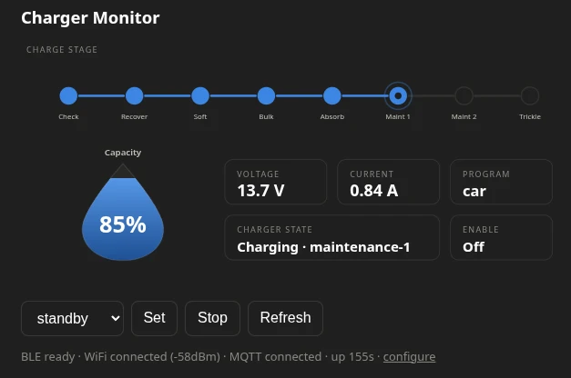

# Charger Monitor

ESP32-C3 firmware that bridges a **Powertech MB3906** Bluetooth battery charger to
your network - live telemetry and control in Home Assistant, a small web UI, and an
OLED, all without the vendor phone app.



The MB3906's BLE protocol is undocumented; it was reverse-engineered from scratch
(see the [blog post](https://fremnet.net/posts/reverse-enginnering-mb3906)). The full protocol is
written up in **[docs/PROTOCOL.md](docs/PROTOCOL.md)** so anyone else with this
charger can build on it.

## Why

Because of a battery that had no business dying. It should have been good; it
wasn't; and there was no way to tell whether the charger had quietly murdered it
or it went of natural causes. The charger knows - it measures voltage and current
constantly and tracks every step of its cycle - but the only witnesses were a tiny
LCD and a phone app with no memory. I wanted a flight recorder: log everything the
charger does, so the next post-mortem has evidence instead of vibes.

The more recent motivation was an 8-hour planned power outage and a battery I'd
rather not lose the same way (I need it to keep the filter box on a turtle pond from going toxic). This time, if something dies, I'll have the receipts
in Home Assistant's history.

## Features

All hardware-verified against a live charger through full charge cycles:

- **BLE monitor + control** - connects, authenticates, streams voltage / current /
  capacity / program / charge step / faults; starts and stops charge programs.
  Auto-reconnects, with an RX watchdog for dead-but-connected links.
- **Home Assistant** - MQTT auto-discovery: 10 sensors (incl. a derived
  charge-delivered Ah counter) plus Program select, a Charging switch (ON resumes
  the last-used program, OFF stops), and a Refresh button. Availability tracks
  the BLE link so HA never shows stale values as live.
- **Web UI + JSON API** - a self-contained status page (charge-stage stepper,
  teardrop capacity gauge, stat tiles) with live push over SSE, plus open
  `GET /api/state` / `/api/info` and Basic-auth control/config endpoints.
- **WiFi provisioning** - first boot opens a captive portal (`ChargerMon-XXXX`)
  that configures WiFi, MQTT, and admin credentials in one form. If the saved
  network later becomes unreachable, a WPA2 fallback AP opens with a configurable
  password and timeout. Connects to the strongest BSSID for the SSID.
- **OTA** - push a `.bin` to `POST /api/ota`; A/B slots with automatic rollback if
  the new image doesn't come up healthy.
- **OLED + LED** - the 0.42" SSD1306 shows stage, capacity, and an alternating
  V/A readout; the onboard LED shows WiFi state.

WiFi loss never interrupts BLE monitoring; every link (BLE / WiFi / MQTT)
reconnects independently.

## The three gotchas that cost the original attempt

If you're hacking on this charger yourself, save yourself the pain
(all detailed in [docs/PROTOCOL.md](docs/PROTOCOL.md)):

1. **Commands go to `fff1`, not `fff2`.** Only the password uses `fff2`. Commands
   sent to `fff2` are silently ignored - no error, no effect.
2. **Current is `/100`, voltage is `/10`.** Different scales on adjacent fields.
3. **The charger sends *you* an ATT Exchange-MTU Request.** Your central must have
   a GATT server able to answer it (on ESP-IDF NimBLE: keep
   `CONFIG_BT_NIMBLE_ROLE_PERIPHERAL=y`), or the charger's ATT bearer times out and
   telemetry silently dies ~30 s in. PC stacks (BlueZ/bleak) answer automatically,
   which makes this one invisible during protocol work.

## Build & flash

PlatformIO with the ESP-IDF framework (the first build fetches the toolchain, which
takes a while):

```bash
pio run                 # build
pio run -t upload       # flash over USB
pio device monitor      # watch the log (ESP32-C3 native USB serial)
```

### First boot

The device raises an open access point `ChargerMon-XXXX`; join it and the captive
portal opens (or browse to `http://192.168.4.1/`). Enter WiFi, MQTT broker, admin
password, and fallback-AP settings; it saves and reboots onto your network. If MQTT
is configured, the charger appears in Home Assistant automatically via MQTT
discovery.

Serial is the guaranteed recovery path: press `w` on the USB console to re-enter
WiFi credentials, `C` to factory-reset the config.

### Everyday use

- `http://<device-ip>/` - live status page (open) with program/stop controls
  (Basic auth `admin` / your admin password).
- `GET /api/state` - full state JSON (open). `GET /api/events` - SSE stream of the
  same. `GET /api/info` - firmware build / slot / uptime.
- `POST /api/control` - `cmd=program&arg=car`, `cmd=stop`, `cmd=refresh` (auth).
- `/config` - re-provision WiFi/MQTT/admin without the portal (auth).
- OTA: `curl -u admin:PASS --data-binary @.pio/build/esp32-c3-devkitm-1/firmware.bin
  http://<device-ip>/api/ota` - flashes the inactive slot and reboots; rolls back
  automatically if the new image fails to boot healthy.

Note: there is no TLS on the device, so Basic auth is a LAN speed-bump, not a
secret. Keep it off the open internet.

## Layout

```
platformio.ini          PlatformIO env (espidf, esp32-c3, OTA partitions)
partitions.csv          A/B OTA-capable partition table
sdkconfig.defaults      NimBLE (central + the load-bearing peripheral role), rollback
src/                    main component (app_main wiring + temporary test console)
components/
  charger_proto/        protocol codec (framing/decode/reassembly), pure C
  charger_ble/          NimBLE central + GATT server for the MTU answer
  charger_state/        single owner of ChargerState; change-detection fan-out
  charger_control/      serialized command writes with readback confirmation
  appcfg/               NVS-backed config store (WiFi/MQTT/admin/fallback-AP)
  wifi/                 STA + captive-portal provisioning + WPA2 fallback AP
  mqtt_ha/              MQTT client + Home Assistant discovery
  web/                  status page, JSON API, SSE, config; Basic-auth writes
  ota/                  POST /api/ota upload, A/B rollback confirmation
  ui/                   SSD1306 72x40 OLED + WiFi status LED
docs/
  PROTOCOL.md           standalone BLE protocol reference
  design/               UI mockup (charge stepper + teardrop gauge)
  web-ui.webp           the status page, live
tools/
  ble_monitor.py        PC-side (bleak) charger client - the protocol oracle
  stamp_touch.py        regenerates the build stamp header each build
```

## Credits

The hard work - the decompiling, the 4am protocol epiphanies, the yanked battery terminals, anything in meat space - was done by a bag of mostly water. Claude (Anthropic's AI, driving [Claude Code](https://claude.com/claude-code)) was then brought in to finish the job and do the bits the bag of mostly water didn't feel like doing: the captive portal, converting scribbled notes into documentation that people can actually read, and a memorable 1am argument with an inline-SVG parser.

Any remaining bugs are a shared achievement.

## License

MIT - see [LICENSE](LICENSE).
